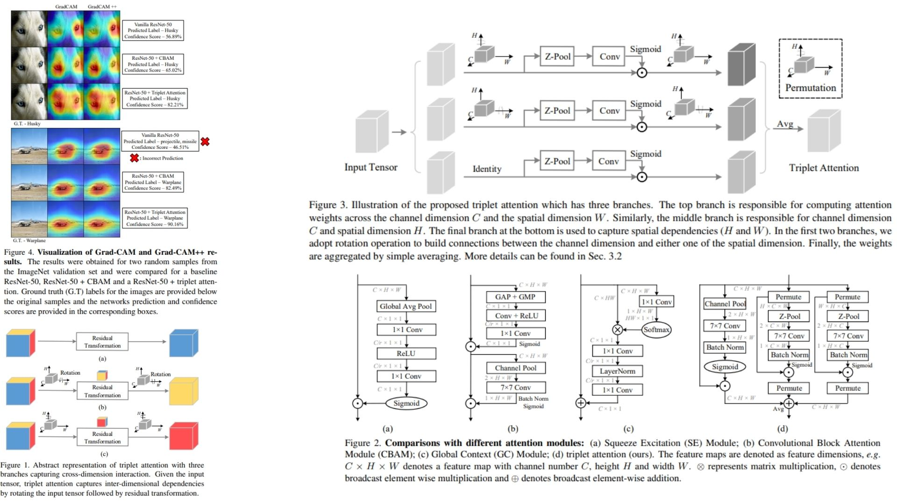

# 🜂 TripletAttention-Replication — Rotate to Attend in CNNs

This repository provides a **faithful PyTorch replication** of  
**Triplet Attention**, a lightweight yet expressive attention mechanism  
that captures **cross-dimensional interactions** in convolutional neural networks ✴︎.

The purpose of this project is **mechanistic understanding and structural fidelity** —  
translating the paper’s **core idea, geometric intuition, and module design**  
into clean, modular code, **without training, datasets, or benchmarks**.

Key characteristics:
- **Three-way attention decomposition** across channel–spatial dimensions ⟁
- **Rotation-based interaction modeling** instead of explicit channel squeezing ⟡
- **Parameter-efficient design** using shared convolutional operators ⚯
- Drop-in compatibility with standard CNN backbones ⎔

**Paper reference:**  [Rotate to Attend: Convolutional Triplet Attention Module (arXiv:2010.03045)](https://arxiv.org/abs/2010.03045) ⧉

---

## ⟁ Overview — Attention as Cross-Dimensional Interaction



> Conventional attention modules typically separate *channel* and *spatial* reasoning.  
> **Triplet Attention reframes this problem geometrically**, allowing each dimension  
> to attend to the others through simple tensor rotations.

Instead of explicitly learning channel importance via global pooling,  
Triplet Attention models **interactions between pairs of dimensions**:

- Channel ↔ Height  
- Channel ↔ Width  
- Height ↔ Width  

Each interaction is processed by an identical attention branch,  
and their outputs are **symmetrically aggregated**.

This design allows the network to reason about  
**what**, **where**, and **how spatial patterns interact with channels**  
without introducing heavy parameterization.

---

## 🧮 Attention Formulation

Given an intermediate feature map

$$
X \in \mathbb{R}^{C \times H \times W},
$$

Triplet Attention constructs **three attention branches**,  
each operating on a rotated view of the tensor.

---

### Z-Pool Operator

Each branch begins with a **Z-Pool** operation,  
which compresses information along one dimension using both average and max pooling:

$$
Z(X) = \left[ \text{AvgPool}(X),\ \text{MaxPool}(X) \right],
$$

resulting in a two-channel descriptor that preserves complementary statistics.

---

### Branch-wise Attention Mapping

For a rotated tensor $$X_r$$, attention is computed as:

$$
A(X_r) = \sigma\bigl(
\text{BN}(
f^{7 \times 7}(Z(X_r))
)\bigr),
$$

where:
- $$f^{7 \times 7}$$ is a convolution capturing local context,
- Batch Normalization stabilizes the response,
- $$\sigma(\cdot)$$ denotes the sigmoid function.

The attention map is then applied element-wise:

$$
X_r' = X_r \odot A(X_r).
$$

Finally, the tensor is **rotated back** to its original orientation.

---

### Triplet Aggregation

Let $$X_{CH}, X_{CW}, X_{HW}$$ denote the outputs of the three branches.  
The final output is obtained via simple averaging:

$$
Y = \frac{1}{3} \left( X_{CH} + X_{CW} + X_{HW} \right).
$$

This symmetric aggregation ensures that  
no single dimension dominates the attention process.

---

## ⚙ Architectural Principle

- **Rotation replaces projection**: attention emerges from geometry, not squeezing
- **Shared branch design** enforces consistency across dimensions
- **Z-Pool preserves contrast** between salient and background responses
- **Averaging fusion** stabilizes gradients and avoids overfitting
- No fully connected layers, no softmax, no global context collapse

The module remains **fully convolutional**,  
efficient, and easy to integrate at arbitrary network depths.

---

## 🧩 Repository Structure

```bash
TripletAttention-Replication/
├── src/
│   ├── utils/
│   │   └── visualization.py
│   │
│   ├── attention/
│   │   ├── z_pool.py
│   │   ├── triplet_branch.py
│   │   └── triplet_attention.py
│   │
│   ├── layers/
│   │   └── conv_layers.py
│   │
│   ├── blocks/
│   │   └── triplet_blocks.py
│   │
│   ├── models/
│   │   └── triplet_model.py
│   │
│   ├── pipeline.py
│   └── config.py
│
├── images/
│   └── triplet_attention_maps.jpg
│
├── requirements.txt
└── README.md
```
---


## 🔗 Feedback

For questions or feedback, contact: [barkin.adiguzel@gmail.com](mailto:barkin.adiguzel@gmail.com)
